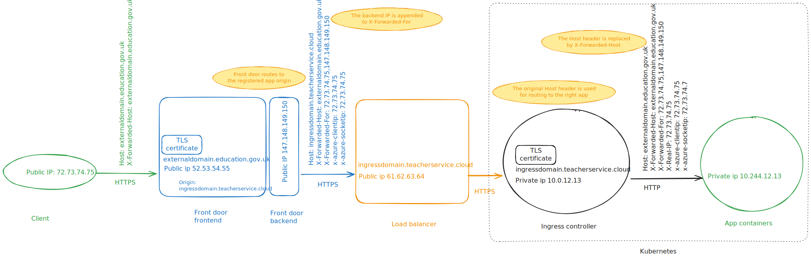

# HTTP request

The diagram shows the itinerary of an HTTP request from the client to the application, including HTTP headers added or transformed along the way. Zoom in this page for details.

Generated with [Excalidraw](https://excalidraw.com/#json=Jzk0aiW5QylakNW57Ychc,blMwDeO05X8smluA65dxFw).
