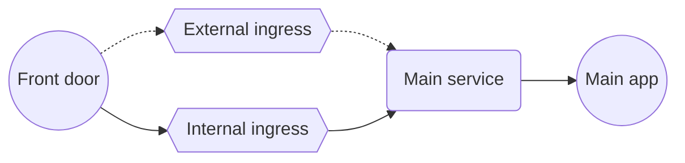
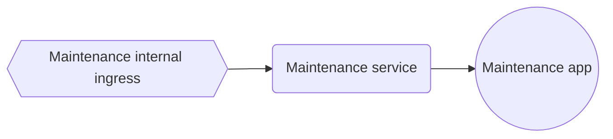
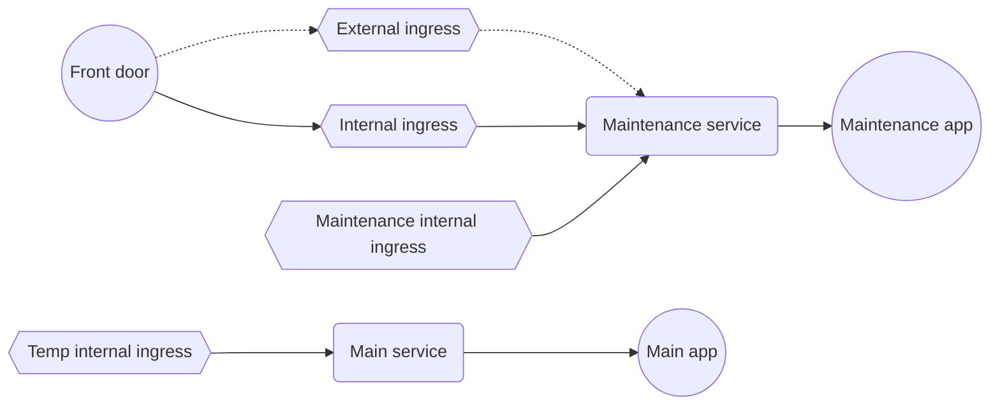

# Maintenance page

The new_service template provides a basic HTML based maintenance page. It deploys a new application which can be used in case of planned maintenance or incident on the main application. It is recommended for user facing services.

It consists of a simple application serving HTML static files. The files can be customised to match the service design and deliver specific content for users, depending on the occasion.

It serves all requests normally received by the main application by modifying the routing of the main application. The URL does not change (no redirect), so users refreshing their browser will go back to the same page when the maintenance ends.

## Initial set-up
Front door sends traffic to the ingress on Kubernetes. By default the ingress uses the internal domain *teacherservice.cloud*. Some services also create an ingress reflecting the external domain, e.g. *www.apply-for-teacher-training.service.gov.uk*. Front door may be set up to connect to one or the other.

The ingresses connect to the service attached to the main application.

## Deploy maintenance app
The maintenance app is deployed, with its own service and ingress. It is available for validation on the *teacherservices.cloud* maintenance ingress.

## Fail over
The main ingresses are reconfigured to point at the maintenance service and user traffic hits the maintenance app.

A temporary ingress pointing at the main app is created. It is used for testing the main app before failing back.

## Initial configuration
- Ensure docker is installed and running locally
- Use the template as described in [Onboard a new service to the Teacher Services AKS cloud platform](onboard-service.md)
- Check the content by opening `new_service/maintenance_page/html/index.html` in a browser and edit the HTML content as needed, including the email in the footer
- Check the domains and kubernetes resource names in `new_service/maintenance_page/manifests`
- Only production and development environments are provided as examples. Copy and amend for new environments.
- If the service uses DSI, then add the temporary ingresses to the DSI configuration
- Create workflows for enable-maintenance and disable-maintenance similar to https://github.com/DFE-Digital/apply-for-teacher-training/blob/main/.github/workflows/enable-maintenance.yml and https://github.com/DFE-Digital/apply-for-teacher-training/blob/main/.github/workflows/disable-maintenance.yml
- The enable-maintenance workflow above should create a package with the correct permissions and visibility settings - if for some reason the workflow is missing or hasn't been run, the package will need to be manually set as public in [github packages](https://github.com/orgs/DFE-Digital/packages).
- Test in each environment

## Update content
There is a default message in `new_service/maintenance_page/html`. Customise it as required for the occasion.

If the maintenance page message needs to be updated at any time during an incident
- update maintenance_page/html/index.html in a new branch
- push the new branch to github
- rerun the *enable maintenance workflow* using the new branch

## Github token
A user with write access to the repository must generate a token.

- Access [Personal access tokens (classic)](https://github.com/settings/tokens)
- Selecte `Generate new token (classic)`
- Give it a name (e.g. "Upload docker image")
- Select `write:packages`
- Click `Generate token`
- Store the token securely

## PIM request
[Raise a PIM request](developer-onboarding.md#how-to-request-pim) to enable maintenance in production.

## Build image and enable maintenance
- Run: `make <environment> enable-maintenance GITHUB_TOKEN=xxx`

## Enable maintenance with an existing image
You can deploy the maintenance image of a known tag:

- Run: `make <environment> enable-fail-over GITHUB_TOKEN=xxx MAINTENANCE_IMAGE_TAG=yyy`

## Configure terraform to keep deploying the application
By default, running terraform will revert the ingress and traffic will flow to the main application again. To be able to deploy the application while keeping the maintenance mode, set `"send_traffic_to_maintenance_page": true`.

The ingress will send the traffic to the service named `${var.service_name}-maintenance` which was created by the above commands.

## Disable maintenance
- Run: `make <environment> disable-maintenance`
