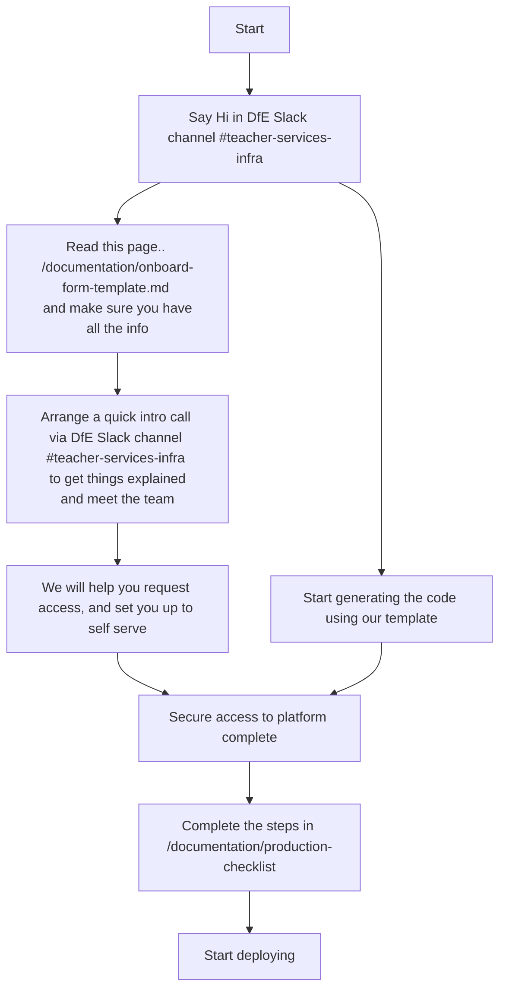

# Onboard a new service to the Teacher Services AKS cloud platform

Onboarding is pretty straightforward and quick..


Before starting, it is important to capture the information required upfront using the  [Onboarding form](onboard-form-template.md) even if it is subject to change in the future. Also, its really important to
check the [Production Checklist](production-checklist.md). Your code should then be ready to roll.

## Template
Most services use the same code to deploy to AKS. It has been made into a template that will evolve over time to capture all the best practices from working in multiple services.
It is used both to dramatically reduce the time required to onboard a new service, and be a point of reference to align standards across repositories.

### Generate code
Run the `make new_service` command with the required environment variables. Example:

```
make new_service SERVICE_NAME=calculate-teacher-pay SERVICE_SHORT=ctp DOCKER_REPOSITORY=ghcr.io/dfe-digital/teacher-pay-calculator NAMESPACE_PREFIX=srtl DNS_ZONE_NAME=calculate-teacher-pay.education.gov.uk
```

This can be built iteratively since the script will stop and show if a variable is missing. Example:

```
% make new_service
bash templates/new_service.sh
templates/new_service.sh: line 26: SERVICE_NAME: unbound variable
make: *** [new_service] Error 1
```

### Copy code to the service's repository
Make sure to copy all the files, including invisible files. Example:

```
cp -r teacher-services-cloud/new_service/. teacher-pay-calculator
```

### Tailor the code
The code covers most common use cases, but it may be necessary to amend it. Examples:
- By default the code deploys a postgres database, but the service may not need it
- The only environment configurations are development and production. The service may need more or use different names.
- The web application uses `/healthcheck` as health probe. It can be changed to another path or disabled by passing `null`.

## Prepare new environment
These steps must be done by the infra team.

### Login to Azure
Raise a [PIM request](https://technical-guidance.education.gov.uk/infrastructure/hosting/azure-cip/#privileged-identity-management-pim-requests) to either:
- `s189-teacher-services-cloud-test` for non production environments
- `s189-teacher-services-cloud-production` for production environments. This must be approved by a third party.

Then login to Azure using `az login`.

### Create terraform environment
This creates the minimum Azure resources required to run terraform, ie storage account and keyvaults.

- Validate: `make <environment config> validate-arm-resources`. Example: `make development validate-arm-resources`
- Deploy: `make <environment config> deploy-arm-resources`. Example: `make development deploy-arm-resources`

### Enable developers access
Amend the AD group of the area:
- Add the namespaces and resource groups to [the AD groups spreadsheet](https://educationgovuk.sharepoint.com/:x:/r/sites/teacher-services-infrastructure/Shared%20Documents/Azure/Teacher%20services%20AD%20groups.xlsx?d=wd9dfa57ba7a64515af86effd063d450a&csf=1&web=1&e=6MdA98). For instance if the service is in BAT, edit the BAT groups (delivery team and production PIM).
- [Raise CIP requests](https://dfe.service-now.com.mcas.ms/serviceportal/?id=sc_cat_item&sys_id=51b0b9c5db1ff7809402e1aa4b96197d&referrer=recent_items) to amend the 2 groups
- The developers should now have access to continue with the set-up

## Deploy new service
In the service repository, runs the Makefile commands.

### Configure Statuscake credentials
If Statuscake is not required at this stage, comment out resources in `terraform/application/statuscake.tf` and the provider in `terraform/application/terraform.tf`.

If it is:
- [Request](https://technical-guidance.education.gov.uk/infrastructure/monitoring/statuscake/#statuscake) a user account and an API key
- Create a secret "STATUSCAKE-API-TOKEN" in the "inf" keyvault, with the API key as value

### Deploy application
Deploy the application, ingress, database...

- Plan: `make <environment config> terraform-plan`. Example: `make development terraform-plan`
- Apply: `make <environment config> terraform-apply`. Example: `make development terraform-apply`

## Custom domain
The new application uses a default domain in `test.teacherservices.cloud` in test and `teacherservices.cloud` in production. Usually a custom domain is required to present a familiar domain to end users, ending in either `education.gov.uk` or `service.gov.uk`.

The code deploys integrated DNS zone and Azure front door **in the production subscription**.

Before proceeding, ensure the following:

- domain.sh exists in global config and there's a make command for it
- The files present in terraform/domains/infrastructure match the sample structure in templates/new_service/terraform/domains/infrastructure, with the appropriate  configuration
- The files present in terraform/domains/environment_domains match the sample structure in templates/new_service/terraform/domains/environment_domains, with the appropriate  configuration

### Create terraform environment
- Validate: `make domains validate-arm-resources`
- Deploy: `make domains deploy-arm-resources`

### Deploy infrastructure
This deploys one DNS zone and one front door which will be used subsequently by all the domains.

- Plan: `make domains-infra-plan`
- Apply: `make domains-infra-apply`

### Delegate DNS zone
Take note of the name servers of the newly created DNS zone and request delegation from either:

- [Infrastructure and networks](https://technical-guidance.education.gov.uk/infrastructure/hosting/dns/#service-now) for the education.gov.uk zone
- [GDS](https://technical-guidance.education.gov.uk/infrastructure/hosting/dns/#official-service-gov-uk-domains) for the service.gov.uk zone

### Create custom domain per environment
This configures the custom domain for a particular environment in the previously create DNS zone and front door.

- Plan: `make <environment config> domains-plan`
- Apply: `make <environment config> domains-apply`

## Enable monitoring
[Enable Statuscake](#configure-statuscake-credentials) if necessary.

Fill in `enable_monitoring`, `external_url` and `statuscake_contact_groups` variables in the environment *tfvars.json* file. Example:

```
"enable_monitoring" : true,
"external_url": "https://calculate-teacher-pay.education.gov.uk/healthcheck",
"statuscake_contact_groups": [195955]
```

Then deploy the environment.

## Deploy via Github actions
When running the make commands for deployment, terraform uses the Azure credentials provided by `az login`.

When running in a Github actions workflow, it uses a [service principal key](https://technical-guidance.education.gov.uk/infrastructure/hosting/azure-cip/#use-the-service-principal-in-external-systems). Follow the process in the documentation to create `AZURE_CREDENTIALS` per environment.

- Use the `s189t01-tsc-contributor` service principal for non production environments to deploy to the test cluster
- Use `s189p01-tsc-contributor` for production environments to deploy to the production cluster

Example workflow:

```yaml
- name: Checkout code
    uses: actions/checkout@v4

- uses: hashicorp/setup-terraform@v3
    with:
    terraform_version: 1.5.1
    terraform_wrapper: false

- uses: DFE-Digital/github-actions/set-arm-environment-variables@master
    with:
    azure-credentials: ${{ secrets.AZURE_CREDENTIALS }}

- name: Apply Terraform
    run: make ci ${{ matrix.environment }} terraform-apply
    env:
        DOCKER_IMAGE_TAG: ${{ needs.build.outputs.docker-image-tag }}
```

## Get ready for production
Follow the [production checklist](production-checklist.md) to make sure the service is ready for end users

## FAQ

### Why does my web application deployment times out?
It may be that the container fails to start. By default, Kubernetes probes the web container on the `/healthcheck` endpoint and expects a successful response with a 200 HTTP code. If the application doesn't have this endpoint or returns an error, it will keep trying until it times out.

Solutions:
- Investigate the pod using `kubectl logs`
- If using rails, it may be that `config.force_ssl = true`. Kubernetes uses HTTP, so the endpoint must be excluded. Ref: [rails documentation](https://api.rubyonrails.org/classes/ActionDispatch/SSL.html)
- If your app uses a different endpoint, change it using: `probe_path = "/endpoint"`
- If your app doesn't have a healthcheck endpoint yet, disable the check temporarily using: `probe_path = null`
