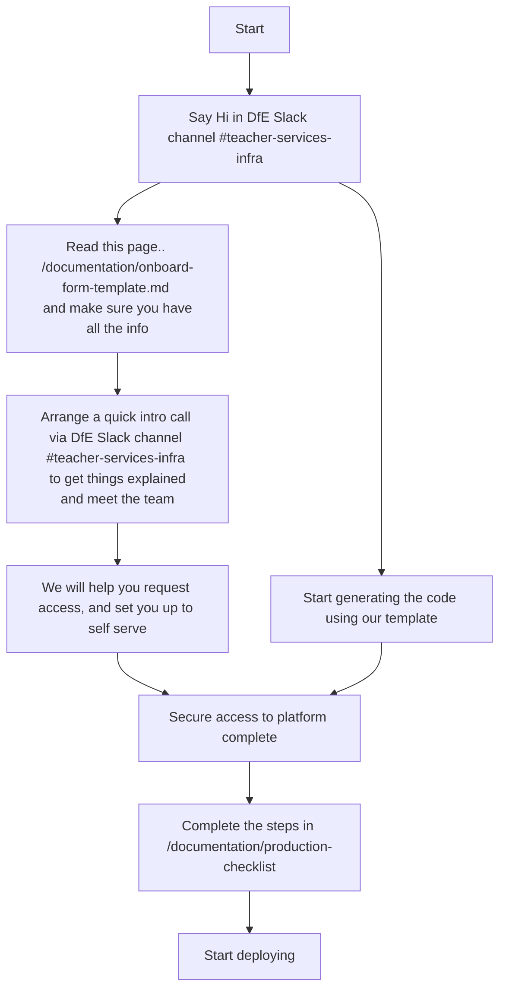

# Onboard a new service to the Teacher Services AKS cloud platform

Onboarding is pretty straightforward and quick..


## Before you start

- Your application needs to be dockerized. The build workflow will make it available at ghcr.io/dfe-digital/your-service-name.
- If you are getting started on a local machine and you have an Apple
Silicon laptop, note that you will need to build your container with the
`--platform=linux/amd64` flag.
- Capture the information required upfront using the [Onboarding form](onboard-form-template.md), even if it is subject to change in the future. Keep it in hedgedoc and update it as you go along.
- Do not forget to check the [Production Checklist](production-checklist.md) in the end

## Template
Most services use the same code to deploy to AKS. It has been made into a template that will evolve over time to capture all the best practices from working in multiple services.
It is used both to dramatically reduce the time required to onboard a new service, and be a point of reference to align standards across repositories.

### Generate code
Run the `make new_service` command with the required environment variables. Example:

```
make new_service SERVICE_NAME=calculate-teacher-pay SERVICE_SHORT=ctp SERVICE_PRETTY="Calculate teacher pay" DOCKER_REPOSITORY=ghcr.io/dfe-digital/teacher-pay-calculator NAMESPACE_PREFIX=srtl DNS_ZONE_NAME=calculate-teacher-pay.education.gov.uk
```

This can be built iteratively since the script will stop and show if a variable is missing. Example:

```
% make new_service
bash templates/new_service.sh
templates/new_service.sh: line 26: SERVICE_NAME: unbound variable
make: *** [new_service] Error 1
```

### Copy code to the service's repository
Make sure to copy all the files, including invisible files. Example:

```
cp -r teacher-services-cloud/new_service/. teacher-pay-calculator
```

Note that for an existing repository, this may clobber your `.gitignore`, `.tool-versions` and `Makefile`. Only add what is missing and check `git diff` to make sure you're not
losing information.

### Tailor the code
The code covers most common use cases, but it may be necessary to amend it. Examples:
- By default the code deploys a postgres database, but the service may not need it
- The only environment configurations are development and production. The service may need more or use different names.
- The web application uses `/healthcheck` as health probe. It can be changed to another path or disabled by passing `null`. If you don't have a
healthcheck endpoint and don't configure or disable this, deployments will time out (See [FAQ](#faq)).

### Github actions workflow templates
Several workflow templates will be created in the .github/workflows directory.
These should be moved to the service repo .github/workflows directory and should be used as templates for post build tasks
- postgres database backups and restores (as part of DR)
- maintenance page enable/disable
- build and deploy
- build without cache

## Prepare new environment
These steps must be done by the infra team.

### Login to Azure
Raise a [PIM request](https://technical-guidance.education.gov.uk/infrastructure/hosting/azure-cip/#privileged-identity-management-pim-requests) to either:
- `s189-teacher-services-cloud-test` for non production environments
- `s189-teacher-services-cloud-production` for production environments. This must be approved by a third party.

Then login to Azure using `az login`.

### Create terraform environment
This creates the minimum Azure resources required to run terraform for this environment:
- **resource group** e.g. s189t01-rsm-ts-rg. Databases and other resources will be created in it. Developers will have read/write access to the resource group and the resources inside.
- **storage account** e.g. s189t01rsmtstfsa. Contains a version blob container to store the terraform state.
- **keyvaults** e.g. s189t01-rsm-ts-app-kv for application secrets and s189t01-rsm-ts-inf-kv for infrastructure secrets

Run:
- Validate: `make <environment config> validate-arm-resources`. Example: `make development validate-arm-resources`
- Deploy: `make <environment config> deploy-arm-resources`. Example: `make development deploy-arm-resources`

### Enable developers access
Amend the AD group of the area:
- Add the namespaces and resource groups to [the AD groups spreadsheet](https://educationgovuk.sharepoint.com/:x:/r/sites/teacher-services-infrastructure/Shared%20Documents/Azure/Teacher%20services%20AD%20groups.xlsx?d=wd9dfa57ba7a64515af86effd063d450a&csf=1&web=1&e=6MdA98). For instance if the service is in BAT, edit the BAT groups (delivery team and production PIM).
- [Raise CIP requests](https://dfe.service-now.com.mcas.ms/serviceportal/?id=sc_cat_item&sys_id=51b0b9c5db1ff7809402e1aa4b96197d&referrer=recent_items) to amend the 2 groups
- The developers should now have access to continue with the set-up

## Deploy new service

### Configure environment variables
The application is configured for each environment using [environment variables](https://12factor.net/config). The [application_configuration](https://github.com/DFE-Digital/terraform-modules/tree/main/aks/application_configuration) module allows setting the variables and mapping them to the application automatically. Internally, *non-secret variables* are stored in a Kubernetes configmap and *secret variables* are stored in a Kubernetes secret.

- Default rails variables are provided by [the terraform module](https://github.com/DFE-Digital/terraform-modules/blob/2fe7c6330db16abc2097cda37ff369c22b398f61/aks/application_configuration/resources.tf#L3)
- Custom non secret variables are configured in the environment yaml files: `terraform/application/config/review.yml`, `terraform/application/config/production.yml`, etc. e.g. external domain, feature flags... They are merged to the terraform module config_variables
- Custom secrets are manually configured in the application key vault created in [Create terraform environment](#create-terraform-environment), and loaded automatically by [the terraform module](https://github.com/DFE-Digital/teacher-services-cloud/blob/a14bc31bad011d3227c9787b1d60011431359373/templates/new_service/terraform/application/application.tf#L9). e.g. rails secret key, notify key...
- Access keys to resources created by terraform like databases or storage accounts are [configured directly via terraform](https://github.com/DFE-Digital/teacher-services-cloud/blob/a14bc31bad011d3227c9787b1d60011431359373/templates/new_service/terraform/application/application.tf#L19) in secret_variables

### Statuscake
If Statuscake monitoring is not required at this stage, comment out resources in `terraform/application/statuscake.tf` and the provider in `terraform/application/terraform.tf`. See the [production checklist](production-checklist#statuscake) for full configuration.

### Deploy application
Deploy the application, ingress, database...

- Plan: `make <environment config> terraform-plan`. Example: `make development terraform-plan`
- Apply: `make <environment config> terraform-apply`. Example: `make development terraform-apply`

## Custom domain
The new application uses a default domain in `test.teacherservices.cloud` in test and `teacherservices.cloud` in production. Usually a [custom domain](https://technical-guidance.education.gov.uk/infrastructure/hosting/dns/#page_toc) is required to present a familiar domain to end users, ending in either `education.gov.uk` or `service.gov.uk`.

The code deploys Azure DNS zone and Azure front door **in the production subscription**.

Before proceeding, ensure the following:

- The total length any "subdomain.domain" (e.g. staging.getintoteaching.education.gov.uk) cannot exceed 64 characters
- [Generate the code](#generate-code) using the template to create:
  - domain.sh in global config
  - domains make commands
  - terraform code in terraform/domains/infrastructure and terraform/domains/environment_domains
- It is possible to set up multiple top-level domains. Duplicate the code in the json files, such as in [ITTMS](https://github.com/DFE-Digital/itt-mentor-services/blob/main/terraform/domains/environment_domains/config/production.tfvars.json).

### Create domains terraform environment
- Validate: `make domains validate-arm-resources`
- Deploy: `make domains deploy-arm-resources`

### Deploy domains infrastructure
This deploys one DNS zone and one front door which will be used subsequently by all the domains.

- Plan: `make domains-infra-plan`
- Apply: `make domains-infra-apply`

### Delegate DNS zone
Take note of the name servers of the newly created DNS zone and request delegation from either:

- [Infrastructure and networks](https://technical-guidance.education.gov.uk/infrastructure/hosting/dns/#service-now) for the education.gov.uk zone
- [GDS](https://technical-guidance.education.gov.uk/infrastructure/hosting/dns/#official-service-gov-uk-domains) for the service.gov.uk zone

### Create custom domain per environment
This configures the custom domain for a particular environment in the previously create DNS zone and front door.

- Plan: `make <environment config> domains-plan`
- Apply: `make <environment config> domains-apply`

## Deploy via Github actions
When running the make commands locally, the Azure credentials provided by `az login` are used by:
- the [terraform azurerm provider](https://registry.terraform.io/providers/hashicorp/azurerm/latest/docs) and [azure cli](https://learn.microsoft.com/en-us/cli/azure/) to authenticate to Azure and managed Azure resources
- [kubelogin](https://azure.github.io/kubelogin/) to authenticate to the Entra ID enabled AKS cluster. kubelogin is required by the [terraform kubernetes provider](https://registry.terraform.io/providers/hashicorp/kubernetes/latest/docs) and any [kubectl](https://kubernetes.io/docs/reference/kubectl/) commands.

When running in a Github actions workflow, authentication is made using [OIDC](https://docs.github.com/en/actions/security-for-github-actions/security-hardening-your-deployments/configuring-openid-connect-in-azure):
- the workflow runs in a Github environment
- this environment is declared as federated credential in a managed identity
- the managed identity is member of the same AD group as in [Enable developers access](#enable-developers-access). This gives it permission to manage Azure resources and kubernetes namespaces.

See [AKS AD groups](https://educationgovuk.sharepoint.com.mcas.ms/sites/teacher-services-infrastructure/SitePages/AKS%20AD%20groups.aspx) for more details.

1. Create the federated credentials by adding the service and environments to the `ga_wif_managed_id` variable
1. Deploy via pull request on this repository
1. In the service repository, create repository secret `AZURE_TENANT_ID`, and for each environment, environment secrets `AZURE_CLIENT_ID` and `AZURE_SUBSCRIPTION_ID`. Get the values from the relevant managed identities in the Azure portal, or from the `ga_wif_config` output of terraform-kubernetes-plan.
1. Create or update the workflows and reference the above secrets. Note that there are [template deployment workflows](https://github.com/DFE-Digital/teacher-services-cloud/tree/main/templates/new_service/.github/workflows) created by `make new_service` and these should be used for any new services.

## Get ready for production
Follow the [production checklist](production-checklist.md) to make sure the service is ready for end users

## FAQ

### Why does my web application deployment time out?
It may be that the container fails to start. By default, Kubernetes probes the web container on the `/healthcheck` endpoint and expects a successful response with a 200 HTTP code. If the application doesn't have this endpoint or returns an error, it will keep trying until it times out.

Solutions:
- Investigate the pod using `kubectl logs`
- If using rails, it may be that `config.force_ssl = true`. Kubernetes uses HTTP, so the endpoint must be excluded. Ref: [rails documentation](https://api.rubyonrails.org/classes/ActionDispatch/SSL.html)
- If your app uses a different endpoint, change it using: `probe_path = "/endpoint"`
- If your app doesn't have a healthcheck endpoint yet, disable the check temporarily using: `probe_path = null`
