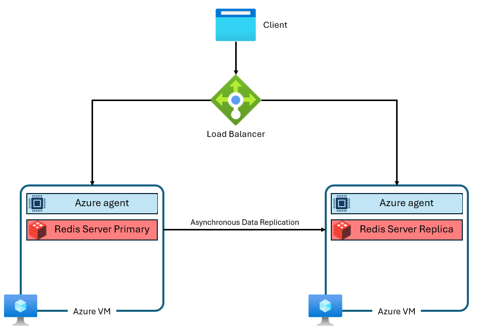
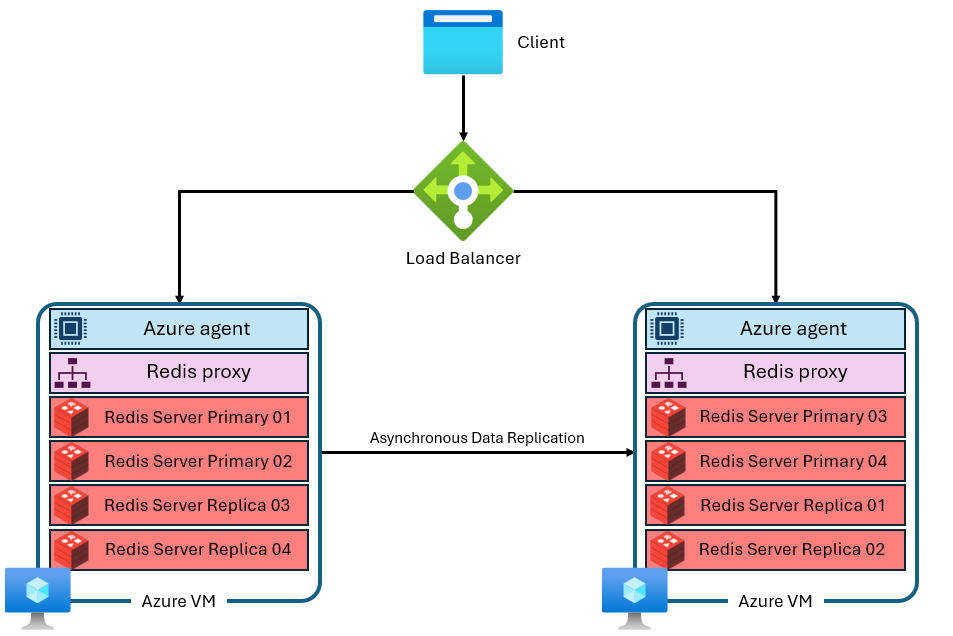

# Migrating to Azure Managed Redis

Microsoft has announced the retirement of Azure Cache for Redis and we therefore need to migrate from Azure Cache for Redis to Azure Managed Redis.

## Trello Card

<https://trello.com/c/AVU5vdjA>

## Timeline

* Azure Cache for Redis (Basic, Standard, Premium):
  * Creation blocked for new customers: April 1, 2026
  * Creation blocked for existing customers: October 1, 2026
  * Retirement Date: September 30, 2028
  * Instances will be disabled starting October 1, 2028

## Original Azure Cache for Redis Infrastructure

A typical Azure Cache for Redis instance uses an architecture like this:



## Advantages of Managed Redis

Azure Managed Redis employs an architecture where each virtual machine, or node, runs multiple Redis server processes called shards in parallel. Multiple shards allow for more efficient utilization of vCPUs on each virtual machine and higher performance.
Not all of the primary Redis shards are on the same VM/node. Instead, primary and replica shards are distributed across both nodes. Because primary shards use more CPU resources than replica shards, this approach enables more primary shards to run in parallel.

Each node has a high-performance proxy process to manage the shards, handle connection management, and trigger self-healing.

Azure Managed Redis is always clustered, internally sharded and optimized for predictable performance and SLA.



## The Initial Situation

Before implementing the migration we had 105 caches of which 2 were basic, 8 premium and 95 standard.

| NAME | LOCATION | STATUS | SIZE | SKU | SUBSCRIPTION | REDIS VERSION | Scale | Per Month |
|-----|----------|--------|------|-----|--------------|---------------|-------|-----------|
| s158t01-redis-cache01 | West Europe | Running | 1 GB | Basic | s158-getinformationaboutschools-test | 6 | C1 Basic | £26.07 |
| s158t02-redis-cache01 | West Europe | Running | 1 GB | Basic | s158-getinformationaboutschools-test | 6 | C1 Basic | £26.07 |
| s189p01-att-production-redis-queue | UK South | Running | 6 GB | Premium | s189-teacher-services-cloud-production | 6 | P1 Premium | £329.13 |
| s189p01-cpdecf-production-redis | UK South | Running | 6 GB | Premium | s189-teacher-services-cloud-production | 6 | P1 Premium | £330.13 |
| s189p01-cpdnpq-production-redis-cache | UK South | Running | 6 GB | Premium | s189-teacher-services-cloud-production | 6 | P1 Premium | £331.13 |
| s189p01-gitapi-production-redis | UK South | Running | 6 GB | Premium | s189-teacher-services-cloud-production | 6 | P1 Premium | £332.13 |
| s189p01-trs-production-redis | UK South | Running | 6 GB | Premium | s189-teacher-services-cloud-production | 6 | P1 Premium | £333.13 |
| s189p01-tv-production-redis-cache | UK South | Running | 6 GB | Premium | s189-teacher-services-cloud-production | 6 | P1 Premium | £334.13 |
| s189p01-tv-production-redis-queue | UK South | Running | 6 GB | Premium | s189-teacher-services-cloud-production | 6 | P1 Premium | £335.13 |
| s158d01-redis-dev | West Europe | Running | 6 GB (1 x 6 GB) | Premium | s158-getinformationaboutschools-development | 6 | P1 Premium | £263.00 |
| s201p01-acfr-01 | West Europe | Running | 250 MB | Standard | s201-CSCP-production | 6 | C0 Standard | £20.89 |
| s201p01-acfr-02 | West Europe | Running | 250 MB | Standard | s201-CSCP-production | 6 | C0 Standard | £21.89 |
| s189t01-afqts-development-redis | UK South | Running | 1 GB | Standard | s189-teacher-services-cloud-test | 6 | C1 Standard | £65.38 |
| s189t01-afqts-test-redis | UK South | Running | 1 GB | Standard | s189-teacher-services-cloud-test | 6 | C1 Standard | £65.38 |
| s189t01-att-qa-redis-cache | UK South | Running | 1 GB | Standard | s189-teacher-services-cloud-test | 6 | C1 Standard | £65.38 |
| s189t01-att-qa-redis-queue | UK South | Running | 1 GB | Standard | s189-teacher-services-cloud-test | 6 | C1 Standard | £65.38 |
| s189t01-att-review-2222-redis-cache | UK South | Running | 1 GB | Standard | s189-teacher-services-cloud-test | 6 | C1 Standard | £65.38 |
| s189t01-att-review-2222-redis-queue | UK South | Running | 1 GB | Standard | s189-teacher-services-cloud-test | 6 | C1 Standard | £65.38 |
| s189t01-att-staging-redis-cache | UK South | Running | 1 GB | Standard | s189-teacher-services-cloud-test | 6 | C1 Standard | £65.38 |
| s189t01-att-staging-redis-queue | UK South | Running | 1 GB | Standard | s189-teacher-services-cloud-test | 6 | C1 Standard | £65.38 |
| s189t01-aytq-preprod-redis | UK South | Running | 1 GB | Standard | s189-teacher-services-cloud-test | 6 | C1 Standard | £65.38 |
| s189t01-aytq-test-redis | UK South | Running | 1 GB | Standard | s189-teacher-services-cloud-test | 6 | C1 Standard | £65.38 |
| s189t01-ccbl-preproduction-redis | UK South | Running | 1 GB | Standard | s189-teacher-services-cloud-test | 6 | C1 Standard | £65.38 |
| s189t01-ccbl-test-redis | UK South | Running | 1 GB | Standard | s189-teacher-services-cloud-test | 6 | C1 Standard | £65.38 |
| … | … | … | … | … | … | … | … | … |
| s201d01-acfr-01 | West Europe | Running | 250 MB | Standard | s201-CSCP-development | 6 | C0 Standard | £20.89 |
| s201t01-acfr-01 | West Europe | Running | 250 MB | Standard | s201-CSCP-test | 6 | C0 Standard | £20.89 |

## SKU Conversion

### From the initial Redis Caches we have the following groups

* 250 MB – C0 Standard
* 1 GB – C1 Basic
* 1 GB – C1 Standard
* 2.5 GB – C2 Standard
* 6 GB – P1 Premium

### Azure Managed Redis equivalents

| Current Azure Cache for Redis | Recommended Managed Redis SKU | Rationale |
|-------------------------------|-------------------------------|-----------|
|250 MB – C0 Standard | Balanced_B1 | Smallest available SKU; Managed Redis starts much larger |
| 1 GB – C1 Basic | Balanced_B1 | B1 provides >1 GB usable memory and HA |
| 1 GB – C1 Standard | Balanced_B1 | Same reasoning; Standard ≠ higher performance in Azure Managed Redis |
| 2.5 GB – C2 Standard | Balanced_B3 | Next valid size that comfortably exceeds 2.5 GB |
| 6 GB – P1 Premium | Balanced_B3 | Closest real match in memory and throughput |

## Scaling

Within a single Azure Managed Redis instance, you can scale up, but you cannot scale down. You cannot go from Balanced_B3 ➜ Balanced_B1 for example. You can however scale up and therefore going from Balanced_B1 ➜ Balanced_B3 is allowed.

### Scaling Down Process

* Create an Azure Managed Redis instance slightly larger than strictly required
* Observe real usage under production load
* If it turns out to be oversized:
  * Create a new, smaller Managed Redis instance
  * Migrate traffic to it
  * Delete the oversized instance

This is a recreate-and-migrate, not a resize.

## Maintenance

Azure Managed Redis does not expose a patch schedule like Azure Cache for Redis did.
Patching is fully managed by Microsoft, happens automatically, and is designed to be non‑disruptive for properly configured instances.

There is no Terraform block equivalent to patch_schedule.

### Fully Microsoft‑managed patching

* OS patches
* Redis engine updates
* Security fixes
* Platform upgrades
* Automatic
* Rolling
* Service‑managed

## Terraform Module

The initial task was to create a terraform module for Azure Managed Redis similar to [terraform-modules/aks/redis at main · DFE-Digital/terraform-modules](https://github.com/DFE-Digital/terraform-modules/tree/main/aks/redis) Note that the module shouldn’t cover every possible option. We should set preferred defaults and only allow overrides for variables we use. So relatively opinionated.

### Variables

| NAME | Description |  Type  | Default | Nullable |
|------|-------------|--------|---------|----------|
| use_azure | Whether to deploy using Azure Redis Cache service | bool |  |


## The Migration Process

### Introduction

Initial steps will be to Review the migration tool and self-service. The migration tool looks to have too many restrictions to be useful.

In most cases we shouldn’t need to copy data, but we should test what we can do if that’s required.

#### Links

[Migrate to or between Azure Cache for Redis Instances](https://learn.microsoft.com/en-us/azure/azure-cache-for-redis/cache-migration-guide)

[Migrate to Azure Managed Redis from other caches](https://learn.microsoft.com/en-us/azure/redis/migrate/migration-guide)

### What the Migration Button Does

#### High‑level summary

The Migrate button does not automatically move your cache to Azure Managed Redis.
Instead, it launches a guided migration workflow that:

Helps you create a new target Redis instance
Guides you through data‑copy options
Leaves application cut‑over entirely up to you

It is a wizard and helper, not a one‑click live migration.

#### Step‑by‑step: What happens when you click Migrate

When you click Migrate on an individual Azure Cache for Redis instance:

##### 1️⃣ Azure opens the migration experience

* You are shown Microsoft messaging about Cache for Redis retirement
* Azure recommends Azure Managed Redis as the target

##### 2️⃣ You choose a migration approach

The wizard presents the same four supported strategies:

| Option | What it does |
|--------|--------------|
| Create a new cache | Creates a new Redis instance; data rebuilds naturally|
| Export / Import (RDB) | One‑time snapshot copy |
| Dual write | App writes to both caches |
| Programmatic copy | You write the tooling |

The button does not force or perform any of these automatically

##### 3️⃣ Azure helps you create the target instance

* You are guided to:
  * Create a new Azure Managed Redis instance
  * Choose region, SKU, networking
* The new instance is separate
* The existing cache remains untouched

##### 4️⃣ Optional data migration assistance

Depending on the path you choose, Azure may:

* Point you to RDB export/import tooling
* Show CLI or Portal steps
* Provide validation checks

Azure does not keep the two caches in sync.
No live replication is created.

##### 5️⃣ Cut‑over is 100% manual

You must:

* Update application configuration
* Change connection strings
* Validate behaviour
* Decommission the old cache yourself

The Migrate flow never switches traffic automatically

### What Azure Managed Redis Exposes

Azure Managed Redis does not expose the same attributes as azurerm_redis_cache.

Key changes:

| Concept | Cache for Redis | Managed Redis |
|---------|-----------------|---------------|
| Resource | azurerm_redis_cache | azurerm_managed_redis |
| Primary key name | primary_access_key | primary_access_key |
| Connection string | Not provided | Not provided |
| SSL port | ssl_port | Always 6380 |
| Endpoint | *.redis.cache.windows.net | *.redis.cache.azure.net |
| Database | /0 | /0 |

Managed Redis does not give us a ready‑made primary_connection_string.
We'll have to construct it ourselves.

### Migration Strategy Using Terraform & Kubernetes

#### Goals

* No or nearly no downtime
* Avoid destructive Terraform changes
* Allow parallel running during migration
* Clean rollback path
* Works with private endpoints and monitoring

#### Implementation Plan Using Terraform

1. Add Managed Redis
2. Match outputs exactly
3. Switch apps by config
4. Delete Redis Cache

##### Add Managed Redis

Add a new Azure Managed Redis module to [terraform-modules](https://github.com/DFE-Digital/terraform-modules).

Azure Cache for Redis is still in use whilst Azure Managed Redis exists but is unused.

##### Match outputs exactly

Construct the outputs "url" and "connection_string" with the same names as in the redis module but as per the values exposed by Azure Managed Redis.

##### Switch apps by config

Now, at the application repository change the application configuration whether that be an environment variable, secret or configuration.

For example, AYTQ have an application module that access a secret

```bash
REDIS_URL = module.redis-cache.url
```

This now becomes:

```bash
REDIS_URL = module.redis-managed.url
```

Let Managed Redis run under real load for a minimum of 3 days but more likely 1 week.

During this period check memory usage, evictions, Redis client reconnects and application error rates.

##### Delete Redis Cache

First check and ensure no Azure Cache for Redis instances exist.
Delete the redis-cache module
