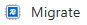

# Migrating to Azure Managed Redis <!-- omit in toc -->

Microsoft has announced the retirement of Azure Cache for Redis and we therefore need to migrate from Azure Cache for Redis to Azure Managed Redis.

## Table of Contents <!-- omit in toc -->

- [Trello Card](#trello-card)
- [Timeline](#timeline)
- [Original Azure Cache for Redis Infrastructure](#original-azure-cache-for-redis-infrastructure)
- [Advantages of Managed Redis](#advantages-of-managed-redis)
- [Full List of Cache for Redis Instances](#full-list-of-cache-for-redis-instances)
- [SKU Conversion](#sku-conversion)
  - [From the initial Redis Caches we have the following groups](#from-the-initial-redis-caches-we-have-the-following-groups)
  - [Azure Managed Redis equivalents](#azure-managed-redis-equivalents)
- [Managed Redis Scaling](#managed-redis-scaling)
  - [Scaling Down Process](#scaling-down-process)
- [Maintenance of Managed Redis](#maintenance-of-managed-redis)
  - [Fully Microsoft‑managed patching](#fully-microsoftmanaged-patching)
- [Terraform Module](#terraform-module)
  - [Resources, Inputs and Outputs](#resources-inputs-and-outputs)
- [The Migration Process](#the-migration-process)
  - [Links](#links)
  - [What the Migration Button Does](#what-the-migration-button-does)
    - [High‑level summary](#highlevel-summary)
    - [Step‑by‑step: What happens when you click Migrate](#stepbystep-what-happens-when-you-click-migrate)
      - [1️⃣ Azure opens the migration experience](#1️⃣-azure-opens-the-migration-experience)
      - [2️⃣ You choose a migration approach](#2️⃣-you-choose-a-migration-approach)
      - [3️⃣ Azure helps you create the target instance](#3️⃣-azure-helps-you-create-the-target-instance)
      - [4️⃣ Optional data migration assistance](#4️⃣-optional-data-migration-assistance)
      - [5️⃣ Cut‑over is 100% manual](#5️⃣-cutover-is-100-manual)
  - [What Azure Managed Redis Exposes](#what-azure-managed-redis-exposes)
  - [Migration Strategy Using Terraform \& Kubernetes](#migration-strategy-using-terraform--kubernetes)
    - [Goals](#goals)
    - [Implementation Plan Using Terraform](#implementation-plan-using-terraform)
      - [1️⃣ Add Azure Managed Redis Instances](#1️⃣-add-azure-managed-redis-instances)
      - [2️⃣ Match outputs exactly](#2️⃣-match-outputs-exactly)
      - [3️⃣ Migrate the data](#3️⃣-migrate-the-data)
        - [Export and import data using an RDB file](#export-and-import-data-using-an-rdb-file)
        - [Dual-write strategy](#dual-write-strategy)
      - [4️⃣ Switch Apps by Altering Config](#4️⃣-switch-apps-by-altering-config)
        - [Terraform Provider Plugins Version](#terraform-provider-plugins-version)
        - [Additional Redis Module Configuration and Variables](#additional-redis-module-configuration-and-variables)
      - [5️⃣ Delete Cache for Redis](#5️⃣-delete-cache-for-redis)

## Trello Card

[2470 - Azure managed Redis](https://trello.com/c/AVU5vdjA)

## Timeline

- Azure Cache for Redis (Basic, Standard, Premium):
  - Creation blocked for new customers: April 1, 2026
  - Creation blocked for existing customers: October 1, 2026
  - Retirement Date: September 30, 2028
  - Instances will be disabled starting October 1, 2028

## Original Azure Cache for Redis Infrastructure

A typical Azure Cache for Redis instance uses an architecture like this:


## Advantages of Managed Redis

Azure Managed Redis employs an architecture where each virtual machine, or node, runs multiple Redis server processes called shards in parallel. Multiple shards allow for more efficient utilization of vCPUs on each virtual machine and higher performance.
Not all of the primary Redis shards are on the same VM/node. Instead, primary and replica shards are distributed across both nodes. Because primary shards use more CPU resources than replica shards, this approach enables more primary shards to run in parallel.

Each node has a high-performance proxy process to manage the shards, handle connection management, and trigger self-healing.

Azure Managed Redis is always clustered, internally sharded and optimized for predictable performance and SLA.


## Full List of Cache for Redis Instances

Before implementing the migration we had 105 caches of which 2 were basic, 8 premium and 95 standard.

| NAME | LOCATION | STATUS | SIZE | SKU | SUBSCRIPTION | REDIS VERSION | Scale | Per Month |
| --- | -------- | ------ | ---- | --- |------------- | -------------- | ----- | --------- |
| s158t01-redis-cache01 | West Europe | Running | 1 GB | Basic | s158-getinformationaboutschools-test | 6 | C1 Basic | £26.07 |
| s158t02-redis-cache01 | West Europe | Running | 1 GB | Basic | s158-getinformationaboutschools-test | 6 | C1 Basic | £26.07 |
| s189p01-att-production-redis-queue | UK South | Running | 6 GB | Premium | s189-teacher-services-cloud-production | 6 | P1 Premium | £329.13 |
| s189p01-cpdecf-production-redis | UK South | Running | 6 GB | Premium | s189-teacher-services-cloud-production | 6 | P1 Premium | £330.13 |
| s189p01-cpdnpq-production-redis-cache | UK South | Running | 6 GB | Premium | s189-teacher-services-cloud-production | 6 | P1 Premium | £331.13 |
| s189p01-gitapi-production-redis | UK South | Running | 6 GB | Premium | s189-teacher-services-cloud-production | 6 | P1 Premium | £332.13 |
| s189p01-trs-production-redis | UK South | Running | 6 GB | Premium | s189-teacher-services-cloud-production | 6 | P1 Premium | £333.13 |
| s189p01-tv-production-redis-cache | UK South | Running | 6 GB | Premium | s189-teacher-services-cloud-production | 6 | P1 Premium | £334.13 |
| s189p01-tv-production-redis-queue | UK South | Running | 6 GB | Premium | s189-teacher-services-cloud-production | 6 | P1 Premium | £335.13 |
| s158d01-redis-dev | West Europe | Running | 6 GB (1 x 6 GB) | Premium | s158-getinformationaboutschools-development | 6 | P1 Premium | £263.00 |
| s201p01-acfr-01 | West Europe | Running | 250 MB | Standard | s201-CSCP-production | 6 | C0 Standard | £20.89 |
| s201p01-acfr-02 | West Europe | Running | 250 MB | Standard | s201-CSCP-production | 6 | C0 Standard | £21.89 |
| s189t01-afqts-development-redis | UK South | Running | 1 GB | Standard | s189-teacher-services-cloud-test | 6 | C1 Standard | £65.38 |
| s189t01-afqts-test-redis | UK South | Running | 1 GB | Standard | s189-teacher-services-cloud-test | 6 | C1 Standard | £65.38 |
| s189t01-att-qa-redis-cache | UK South | Running | 1 GB | Standard | s189-teacher-services-cloud-test | 6 | C1 Standard | £65.38 |
| s189t01-att-qa-redis-queue | UK South | Running | 1 GB | Standard | s189-teacher-services-cloud-test | 6 | C1 Standard | £65.38 |
| s189t01-att-review-2222-redis-cache | UK South | Running | 1 GB | Standard | s189-teacher-services-cloud-test | 6 | C1 Standard | £65.38 |
| s189t01-att-review-2222-redis-queue | UK South | Running | 1 GB | Standard | s189-teacher-services-cloud-test | 6 | C1 Standard | £65.38 |
| s189t01-att-staging-redis-cache | UK South | Running | 1 GB | Standard | s189-teacher-services-cloud-test | 6 | C1 Standard | £65.38 |
| s189t01-att-staging-redis-queue | UK South | Running | 1 GB | Standard | s189-teacher-services-cloud-test | 6 | C1 Standard | £65.38 |
| s189t01-aytq-preprod-redis | UK South | Running | 1 GB | Standard | s189-teacher-services-cloud-test | 6 | C1 Standard | £65.38 |
| s189t01-aytq-test-redis | UK South | Running | 1 GB | Standard | s189-teacher-services-cloud-test | 6 | C1 Standard | £65.38 |
| s189t01-ccbl-preproduction-redis | UK South | Running | 1 GB | Standard | s189-teacher-services-cloud-test | 6 | C1 Standard | £65.38 |
| s189t01-ccbl-test-redis | UK South | Running | 1 GB | Standard | s189-teacher-services-cloud-test | 6 | C1 Standard | £65.38 |
| … | … | … | … | … | … | … | … | … |
| s201d01-acfr-01 | West Europe | Running | 250 MB | Standard | s201-CSCP-development | 6 | C0 Standard | £20.89 |
| s201t01-acfr-01 | West Europe | Running | 250 MB | Standard | s201-CSCP-test | 6 | C0 Standard | £20.89 |

## SKU Conversion

### From the initial Redis Caches we have the following groups

- 250 MB – C0 Standard
- 1 GB – C1 Basic
- 1 GB – C1 Standard
- 2.5 GB – C2 Standard
- 6 GB – P1 Premium

### Azure Managed Redis equivalents

| Current Azure Cache for Redis | Recommended Managed Redis SKU | Rationale |
| ----------------------------- | ----------------------------- | ---------- |
| 250 MB – C0 Standard | Balanced_B1 | Smallest available SKU; Managed Redis starts much larger |
| 1 GB – C1 Basic | Balanced_B1 | B1 provides >1 GB usable memory and HA |
| 1 GB – C1 Standard | Balanced_B1 | Same reasoning; Standard ≠ higher performance in Azure Managed Redis |
| 2.5 GB – C2 Standard | Balanced_B3 | Next valid size that comfortably exceeds 2.5 GB |
 | 6 GB – P1 Premium | Balanced_B3 | Closest real match in memory and throughput |

## Managed Redis Scaling

Within a single Azure Managed Redis instance, you can scale up, but you cannot scale down. You cannot go from Balanced_B3 ➜ Balanced_B1 for example. You can however scale up and therefore going from Balanced_B1 ➜ Balanced_B3 is allowed.

### Scaling Down Process

- Create an Azure Managed Redis instance slightly larger than strictly required
- Observe real usage under production load
- If it turns out to be oversized:
  - Create a new, smaller Managed Redis instance
  - Migrate traffic to it
  - Delete the oversized instance

This is a recreate-and-migrate, not a resize.

## Maintenance of Managed Redis

Azure Managed Redis does not expose a patch schedule like Azure Cache for Redis did.
Patching is fully managed by Microsoft, happens automatically, and is designed to be non‑disruptive for properly configured instances.

There is no Terraform block equivalent to patch_schedule.

### Fully Microsoft‑managed patching

- OS patches
- Redis engine updates
- Security fixes
- Platform upgrades
- Automatic
- Rolling
- Service‑managed

## Terraform Module

A new terraform module for `Azure Managed Redis` [terraform-modules/aks/redis at main · DFE-Digital/terraform-modules](https://github.com/DFE-Digital/terraform-modules/tree/main/aks/redis-managed) has been created.

Note that the module doesn't cover every possible option. The preferred defaults have been set and only allow overrides for variables we use. So it is relatively opinionated.

### Resources, Inputs and Outputs

See terraform/aks/vendor/modules/aks/aks/redis_managed/tfdocs.md

## The Migration Process

### Links

[Migrate to or between Azure Cache for Redis Instances](https://learn.microsoft.com/en-us/azure/azure-cache-for-redis/cache-migration-guide)

[Migrate to Azure Managed Redis from other caches](https://learn.microsoft.com/en-us/azure/redis/migrate/migration-guide)

### What the Migration Button Does

There is a Migrate button on the Azure Cache for Redis Console Overview. Do not use this method.



#### High‑level summary

The Migrate flow, accessed through the Migrate button, never switches traffic automatically and it is therefore not recommended.

The Migrate button does not automatically move your cache to Azure Managed Redis.
Instead, it launches a guided migration workflow that helps you create a new target Redis instance. It then guides you through data‑copy options and leaves application cut‑over entirely up to you.

It is a wizard and helper, not a one‑click live migration.

#### Step‑by‑step: What happens when you click Migrate

When you click Migrate on an individual Azure Cache for Redis instance:

##### 1️⃣ Azure opens the migration experience

- You are shown Microsoft messaging about Cache for Redis retirement
- Azure recommends Azure Managed Redis as the target

##### 2️⃣ You choose a migration approach

The wizard presents the same four supported strategies:

| Option | What it does |
| ------ | ------------ |
| Create a new cache | Creates a new Redis instance; data rebuilds naturally |
| Export / Import (RDB) | One‑time snapshot copy |
| Dual write | App writes to both caches |
| Programmatic copy | You write the tooling |

The button does not force or perform any of these automatically

##### 3️⃣ Azure helps you create the target instance

- You are guided to:
  - Create a new Azure Managed Redis instance
  - Choose region, SKU, networking
- The new instance is separate
- The existing cache remains untouched

##### 4️⃣ Optional data migration assistance

Depending on the path you choose, Azure may:

- Point you to RDB export/import tooling
- Show CLI or Portal steps
- Provide validation checks

Azure does not keep the two caches in sync.
No live replication is created.

##### 5️⃣ Cut‑over is 100% manual

You must:

- Update application configuration
- Change connection strings
- Validate behaviour
- Decommission the old cache yourself

### What Azure Managed Redis Exposes

Azure Managed Redis does not expose the same attributes as azurerm_redis_cache.

Key changes:

| Concept | Cache for Redis | Managed Redis |
| ------- | --------------- | ------------- |
| Resource | azurerm_redis_cache | azurerm_managed_redis |
| Primary key name | primary_access_key | primary_access_key |
| Connection string | Not provided | Not provided |
| SSL port | ssl_port | Always 6380 |
| Endpoint | *.redis.cache.windows.net | *.redis.cache.azure.net |
| Database | /0 | /0 |

Managed Redis does not give us a ready‑made primary_connection_string.
We'll have to construct it ourselves.

### Migration Strategy Using Terraform & Kubernetes

#### Goals

- No or nearly no downtime
- Avoid destructive Terraform changes
- Allow parallel running during migration
- Clean rollback path
- Works with private endpoints and monitoring

#### Implementation Plan Using Terraform

1. Add equivalent Azure Managed Redis instances
1. Match outputs exactly to the new values required
1. Migrate the data (Premium SKU only)
1. Switch the application to use the new Redis instances by updating the configuration
1. Delete the Cache for Redis instances

##### 1️⃣ Add Azure Managed Redis Instances

Add a new Azure Managed Redis module to [terraform-modules](https://github.com/DFE-Digital/terraform-modules).

Azure Cache for Redis is still in use whilst Azure Managed Redis exists but is unused.

##### 2️⃣ Match outputs exactly

Construct the outputs "url" and "connection_string" with the same names as in the redis module but as per the values exposed by Azure Managed Redis.

##### 3️⃣ Migrate the data

###### Export and import data using an RDB file

This is only supported for Premium tier and provides a point-in-time snapshot of your data.

- **Pros**: Simple, compatible with any Redis cache.
- **Cons**: Data written after the snapshot is taken isn't captured.

Steps:

1. Export the RDB file from the existing Azure Cache for Redis instance using the [export instructions](https://learn.microsoft.com/en-gb/azure/azure-cache-for-redis/cache-how-to-import-export-data#export) or the [PowerShell Export cmdlet](https://learn.microsoft.com/en-us/powershell/module/az.rediscache/export-azrediscache).
1. Import the RDB file into the new Azure Managed Redis instance using the [import instructions](https://learn.microsoft.com/en-gb/azure/redis/how-to-import-export-data) or the PowerShell Import cmdlet.

If your instance is currently standard, having to scale up to a Premium SKU will incur approximately 5 times the current costs (£65 to £330).

###### Dual-write strategy

Best when you need zero data loss and can tolerate running two caches temporarily.

- **Pros**: No data loss, no downtime, uninterrupted operations.
- **Cons**: Requires running two caches for an extended period.

Steps:

1. Modify your application code to write to both the existing cache and the new Azure Managed Redis instance.
1. Continue reading data from the existing cache until the new instance is sufficiently populated.
1. Update the application code to read and write from the new instance only.

##### 4️⃣ Switch Apps by Altering Config

###### Terraform Provider Plugins Version

At the time of investigation, Azure Managed Redis is very new and Terraform requires provider plugin version 4.71.0 or above

```terraform
terraform {
  required_version = "= 1.14.5"
  required_providers {
    azurerm = {
      source  = "hashicorp/azurerm"
      version = "4.71.0"
    }
  }
}
```

###### Additional Redis Module Configuration and Variables

Add additional variables and module blocks as necessary to match the number of Cache for Redis instances you have.

For example:

```terraform
variable "redis_managed_cache_sku_name" {
  description = "The features and specification of the Managed Redis instance to deploy."
  type = string
  default = "Balanced_B1"
  nullable = false
  validation {
    condition = contains(["Balanced_B0", "Balanced_B1", "Balanced_B10", "Balanced_B100", "Balanced_B1000", "Balanced_B150",
    "Balanced_B20", "Balanced_B250", "Balanced_B3", "Balanced_B350", "Balanced_B5", "Balanced_B50", "Balanced_B500", "Balanced_B700",
     "ComputeOptimized_X10", "ComputeOptimized_X100", "ComputeOptimized_X150", "ComputeOptimized_X20", "ComputeOptimized_X250",
     "ComputeOptimized_X3", "ComputeOptimized_X350", "ComputeOptimized_X5", "ComputeOptimized_X50", "ComputeOptimized_X500",
     "ComputeOptimized_X700", "FlashOptimized_A1000", "FlashOptimized_A1500", "FlashOptimized_A2000", "FlashOptimized_A250",
     "FlashOptimized_A4500", "FlashOptimized_A500", "FlashOptimized_A700", "MemoryOptimized_M10", "MemoryOptimized_M100",
     "MemoryOptimized_M1000", "MemoryOptimized_M150", "MemoryOptimized_M1500", "MemoryOptimized_M20", "MemoryOptimized_M2000",
     "MemoryOptimized_M250", "MemoryOptimized_M350", "MemoryOptimized_M50", "MemoryOptimized_M500", "MemoryOptimized_M700"],
     var.azure_managed_redis_sku)
    error_message = "The SKU must be one the values defined at https://registry.terraform.io/providers/hashicorp/azurerm/latest/docs/resources/managed_redis#sku_name-1"
  }
}
variable "redis_managed_queue_sku_name" {
  description = "The features and specification of the Managed Redis instance to deploy."
  type = string
  default = "Balanced_B1"
  nullable = false
  validation {
    condition = contains(["Balanced_B0", "Balanced_B1", "Balanced_B10", "Balanced_B100", "Balanced_B1000", "Balanced_B150",
    "Balanced_B20", "Balanced_B250", "Balanced_B3", "Balanced_B350", "Balanced_B5", "Balanced_B50", "Balanced_B500", "Balanced_B700",
     "ComputeOptimized_X10", "ComputeOptimized_X100", "ComputeOptimized_X150", "ComputeOptimized_X20", "ComputeOptimized_X250",
     "ComputeOptimized_X3", "ComputeOptimized_X350", "ComputeOptimized_X5", "ComputeOptimized_X50", "ComputeOptimized_X500",
     "ComputeOptimized_X700", "FlashOptimized_A1000", "FlashOptimized_A1500", "FlashOptimized_A2000", "FlashOptimized_A250",
     "FlashOptimized_A4500", "FlashOptimized_A500", "FlashOptimized_A700", "MemoryOptimized_M10", "MemoryOptimized_M100",
     "MemoryOptimized_M1000", "MemoryOptimized_M150", "MemoryOptimized_M1500", "MemoryOptimized_M20", "MemoryOptimized_M2000",
     "MemoryOptimized_M250", "MemoryOptimized_M350", "MemoryOptimized_M50", "MemoryOptimized_M500", "MemoryOptimized_M700"],
     var.azure_managed_redis_sku)
    error_message = "The SKU must be one the values defined at https://registry.terraform.io/providers/hashicorp/azurerm/latest/docs/resources/managed_redis#sku_name-1"
  }
}
```

```terraform
module "redis-managed-cache" {
  source = "./vendor/modules/aks//aks/redis_managed"

  name                  = "redis-managed-cache"
  namespace             = var.namespace
  environment           = local.app_name_suffix
  azure_resource_prefix = var.azure_resource_prefix
  service_name          = var.service_name
  service_short         = var.service_short
  config_short          = var.config_short

  cluster_configuration_map = module.cluster_data.configuration_map

  use_azure               = var.deploy_azure_backing_services
  azure_enable_monitoring = var.enable_alerting

  azure_managed_redis_sku = var.redis_managed_cache_sku_name
}

module "redis-managed-queue" {
  source = "./vendor/modules/aks//aks/redis_managed"

  name                  = "redis-managed-queue"
  namespace             = var.namespace
  environment           = local.app_name_suffix
  azure_resource_prefix = var.azure_resource_prefix
  service_name          = var.service_name
  service_short         = var.service_short
  config_short          = var.config_short

  cluster_configuration_map = module.cluster_data.configuration_map

  use_azure               = var.deploy_azure_backing_services
  azure_enable_monitoring = var.enable_alerting

  azure_managed_redis_sku = var.redis_managed_cache_sku_name
}
```

Change the application configuration whether that be an environment variable, secret or configuration.

For example, AYTQ have an application module that access a secret

```bash
REDIS_URL       = module.redis-queue.url
REDIS_CACHE_URL = module.redis-cache.url
```

This now becomes:

```bash
REDIS_URL       = module.redis-managed-queue.url
REDIS_CACHE_URL = module.redis-managed-cache.url
```

Let Managed Redis run under real load for a minimum of 3 days but more likely 1 week.

During this period check memory usage, evictions, Redis client reconnects and application error rates.

##### 5️⃣ Delete Cache for Redis

At the application stage, delete the module sections relating the old Cache for Redis and associated variables

```terraform
azure_maxmemory_policy
azure_patch_schedule
azure_capacity
azure_family
azure_sku_name
server_version
```

When all instances of Azure Cache for Redis have been migrated across all services, check the console to ensure there are no Cache for Redis instances left.

Delete the redis-cache module and associated variables.
